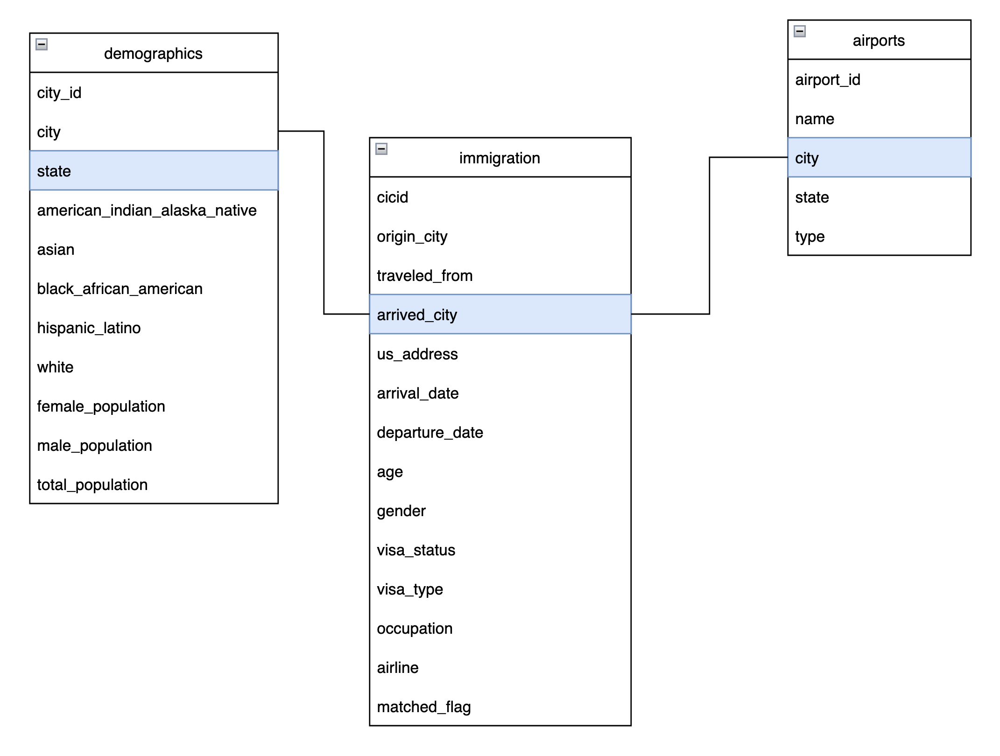
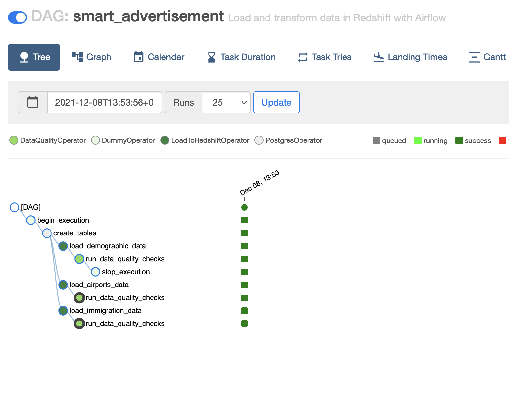
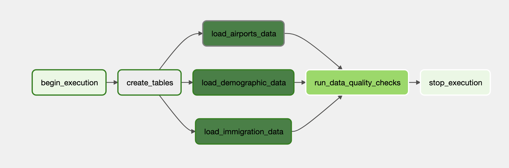
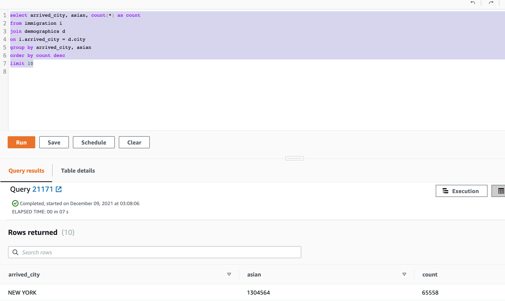
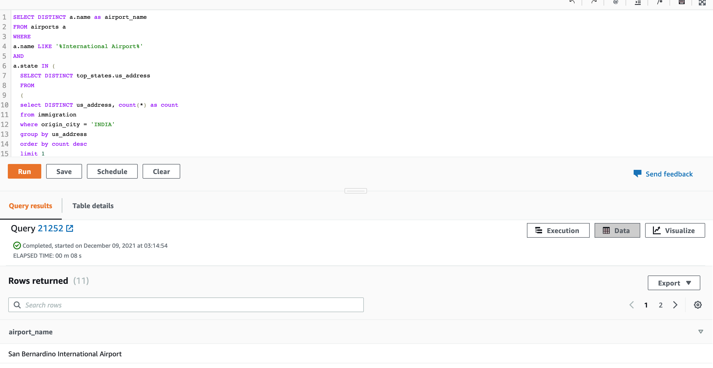

# Smart advertisement service

## Problem description

 Advertisement is traditional and one of the major approach adopted by the business to introduce their products or services to the target consumers. Almost all business uses advertisement to increase the revenue. Due to the advancement in technology and increase in competition, the business are experimenting on strategies to advertise effectively and economically.

## Business Model

An advertising consultant startup in US, which focuses on consulting range of business on effective advertisement, wants to adapt the cutting edge technology in order to enhance their quality of services. Lately conducted research on company has found out that around 14 percent of the national population are immigrant, [source](https://www.americanimmigrationcouncil.org/research/immigrants-in-the-united-states) . Thus the company has decided to build a data warehouse which will used for analytics for better consultation on advertisement. Not limited to that, the warehouse will also be used as a brain for backend services that will possibly automate the advertisement of certain category.

## Datasets

For this project I have used three data sources

- I94 immigration data that comes from the US National Tourism and Trade Office, [source](https://www.trade.gov/national-travel-and-tourism-office).
- U.S City demographic data that comes from Opensoft, [source](https://www.kaggle.com/berkeleyearth/climate-change-earth-surface-temperature-data).
- Airports data from Datahub, [source](https://datahub.io/core/airport-codes#data)

## Technology used

- Python
- Apache Airflow
- Amazon S3
- Amazon EMR
- Amazon Redshift
- Notion for project management
- Github for version control

## Explore data quality

The exploration of data quality is performed using jupyter notebook in Step 2(Explore and Assess the Data). You could view the notebook smart_advertisement_capstone.ipynb. 

## Data model

The conceptual model has been designed keeping into the mind that the model will be used for finding effective advertisement strategies targeted for immigrants. Therefore, I have considered the immigration as a fact table, which consists of details regarding the immigrant. Further, the demographics and airports as dimension tables, since these tables will allow us to estimate the details about the movement of immigrants.

Only looking at the conceptual model we could say that from this model we could easily extract information such as:

- Average age of immigrant of certain visa type
- Total number of Asian living in particular city
- Peak month of travel

The list could go on, and each insights could be effectively used for making advertisement decision.



### Data dictionary

A brief description for each field in each table of the conceptual model is given below:

#### immigration (fact_table)

|   column_name  |                              description                              | old_column_name |
|:--------------:|:---------------------------------------------------------------------:|:---------------:|
|      cicid     |               Unique identifier  of the immigrant record              |      cicid      |
|   origin_city  |                      City of origin of immigrant                      |      i94cit     |
|  traveled_from |                 City from where the immigrant traveled                |      i94res     |
|  arrived_city  |          City where immigrant arrived, extracted from i94port         |        -        |
|   us_address   |                       Address of immigrant in US                      |     i94addr     |
|  arrival_date  |                      Date of arrival of immigrant                     |     arrdate     |
| departure_date |              Date on which the immigrant departed form US             |     depdate     |
|       age      |                          Age of the immigrant                         |       age       |
|     gender     |                        Gender of the immigrant                        |      gender     |
|   visa_status  |                      Visa status of the immigrant                     |     i94visa     |
|    visa_type   |                         Visa type of immigrant                        |     visatype    |
|   occupation   |                     Occupation of immigrant in US                     |      occup      |
|     airline    |              Airline through which the immigrant traveled             |     airline     |
|  matched_flag  | Flag that denotes the user has arrived and departed(or visa expired) |     mat_flag    |


#### demographics (dim_table)

| column_name                   | description                                                     |
|-------------------------------|-----------------------------------------------------------------|
| city_id                       | Unique id of for the city                                       |
| city                          | Name of city                                                    |
| state                         | State of city                                                   |
| american_indian_alaska_native | Total population of American Indian or Alaska Native in the city |
| asian                         | Total population of Asian in the city                           |
| hispanic_latino               | Total population of Hispanic or Latino                          |
| white                         | Total population of White                                       |
| female_population             | Total number of females                                         |
| male_population               | Total number of males                                           |
| total_population              | Total population of the city                                    |

#### airports (dim_table)

| column_name | description                                                 |
|-------------|-------------------------------------------------------------|
| airport_id  | Unique identifier of an airport                             |
| name        | Name of the airport                                         |
| city        | City at which the airport is located, extracted from region |
| state       | State at which the airport is located                       |
| type        | Type of the airport                                         |

## Data pipelines

All of the collected data were stored in the s3 data lake without transforming. In order to transform the data into the conceptual model following steps were taken

- Using Amazon EMR the data stored in s3 were transformed as shown in conceptual model
- The transformed data are than stored in s3
- The transformed data stored in s3 is than loaded to the redshift
- The loading of data has been monitored using Apache airflow

    - Tree

    

    - Graph

    


## Project writeup

### Clearly state the rationale for the choice of tools and technologies for the project.

During the development of the proposed smart advertisement system several tools and technologies were used as mentioned [above](##technology-used). I have selected each tools very carefully with consideration of project goal and time. For cloud I have selected amazon because of the following services:

- Amazon s3: It is low cost, highly available, secure, infinitely scalable and easy to manage object storage service. This is perfect because effectiveness of the smart advertisement service will increases with the amount of data thus the service should increase the size of the datasets as much as possible.

- Amazon EMR: This service enables us to easily transform our data using apache spark which is lightning fast analytics engine for big data.

- Amazon Redshift: This service is a fast, easy, and secure cloud data warehousing service that provides high scalability. Since it is fast it is the best choice for developing api endpoints for dashboard and automatic advertisement in near future. 

- Managed Apache Airflow: This service allows running of airflow without maintaining servers. The airflow is extremely important tool for monitoring etl tasks. It provides a visual representation of etl process, which is highly valuable for debugging and making discussion easier with data scientist and data analyst.

Furthermore, I have used notion for project management and github for the version control. These two tool are must used tools for effective delivery of a product. Also, I have used python as a programming language because I love writing codes in python.

### Propose how often the data should be updated and why ?

The data should be updated once a month because it would be difficult get data from US National Tourism and Trade Office often since the data has to be requested. Also, in the real product we will be using huge amount, performing analysis on one month old data might have nearly same effectiveness.

### How to approach the problem if the data was increased by 100x.

- Transforming data: Currently in EMR only one master and slave node are running, since the EMR is highly scalable, I would have used appropriate number of slaves. I would also have partitioned the immigration data by month while writing in parquet format.

- Loading data to redshift: I would have increase the size of the warehouse and while copying the data from s3 to redshift I would have used template filed that would allow to load timestamped files from S3 based on the execution time and run backfills.

### The data populates a dashboard that must be updated on a daily basis by 7am every day.

- Use airflow to schedule and run pipelines

### The database needed to be accessed by 100+ people.

- The redshift supports concurrency scaling feature, which automatically adds additional cluster capacity to process an increase in both read and write queries. According to the aws documentation it could support virtually unlimited users and concurrent queries, [ref](https://docs.aws.amazon.com/redshift/latest/dg/concurrency-scaling.html).

## Testing the developed model for a real client

### CASE A

An immigration consultation company focused on asian immigrants wants to boost their facebook adds on some specific cities, and thus they want to know top 10 cities with higher number of immigrants this year and total number of asians in that city.

```
select arrived_city, asian, count(*) as count
from immigration i
join demographics d
on i.arrived_city = d.city
group by arrived_city, asian
order by count desc
limit 10
```



### CASE B

A visa consultant specialize in visa consultation to Indian citizens wants to purchase bill board in airports. However they want select which state airports to target and their names.

- Find the state with higher indain travellers

```
SELECT DISTINCT a.name as airport_name
FROM airports a
WHERE
a.name LIKE '%International Airport%'
AND
a.state IN (
  SELECT DISTINCT top_states.us_address
  FROM
  (
  select DISTINCT us_address, count(*) as count
  from immigration
  where origin_city = 'INDIA'
  group by us_address
  order by count desc
  limit 1
  )AS top_states
 ) 
```

